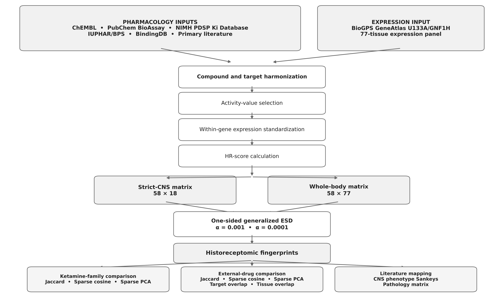

# Ketamine Historeceptomics

[](https://github.com/ericrosenn1/ketamine-historeceptomics/actions/workflows/ci.yml)
[](LICENSE)
[](pyproject.toml)
[](https://github.com/ericrosenn1/ketamine-historeceptomics/releases/tag/v0.1.1)

Ketamine Historeceptomics is a reproducible computational implementation that
combines compound-target pharmacology with target expression across human
tissues. It represents ketamine, its enantiomers and metabolites, and 25
psychoactive reference drugs as numerical historeceptomic score matrices and
sparse target-anatomy fingerprints.

The principal analyses compare sparse fingerprints. Continuous comparisons on
the frozen common-RHR scale are exploratory and are kept separate throughout
the code, results, and interpretation.

This repository accompanies the current working manuscript,
**_Historeceptomic Profiling of Ketamine, Its Enantiomers, and Metabolites_**,
by Eric Rosenn and Timothy Cardozo. No journal, DOI, publication date, or
publication status is asserted here. Eric Rosenn remains the author of the
software release; manuscript and software authorship are recorded separately.

This public release includes the software, synthetic Smoke fixtures, 60
byte-preserved reference-output files, and one cleared class-membership table.
Twenty near-source numerical inputs are not redistributed. Smoke is fully
self-contained; Verify and Full require those exact inputs in a user-supplied
directory validated against [`EXTERNAL_INPUT_MANIFEST.tsv`](EXTERNAL_INPUT_MANIFEST.tsv).

## Core concepts

- **HR score:** selected target-level pharmacological activity, expressed as
  pActivity, multiplied by the standardized expression of that target in one
  tissue.
- **HR-score matrix:** the target × anatomy matrix of supported HR scores for one
  compound. Unsupported coordinates remain missing.
- **Historeceptomic fingerprint:** the sparse set of target-anatomy coordinates
  selected as upper-tail outliers by one-sided generalized extreme Studentized
  deviate (GESD) testing.
- **Fingerprint comparison:** call-set comparisons such as Jaccard similarity,
  overlap, and support-aware sparse multivariate analysis.
- **Continuous comparison:** exploratory comparison of underlying numerical HR
  values after frozen common-RHR projection and matched-support restriction.

A tested non-call and an unsupported coordinate are not interchangeable. Zero
is used only for a tested non-call in a binary fingerprint matrix; unsupported
or untested coordinates stay missing.

## Analysis workflow



## Scientific scope

### Primary fingerprint analyses

- pooled-parent ketamine strict-CNS and whole-body fingerprints;
- 10 ketamine-family numerical profiles and all 45 unordered family pairs;
- comparison with 25 psychoactive reference drugs, for 35 profiles and 595
  unordered global pairs;
- call-set overlap, Jaccard similarity, nonshared-call subtraction, overlap
  coefficient, and signed sparse cosine;
- support-aware sparse-fingerprint PCA at the primary and sensitivity
  thresholds.

### Exploratory continuous analyses

- matched-coordinate common-RHR differences and distances;
- cosine similarity and correlations where estimable;
- continuous PCA, PCoA, metric MDS, and average-linkage clustering;
- target-level summaries and class-context analyses;
- fixed-reference projection, where ketamine-family profiles do not refit the
  25-drug reference axes.

Continuous outputs are provided for reproduction and hypothesis generation.
They are not presented as primary fingerprint comparisons.

### Manuscript downstream interpretation

The current manuscript also includes two literature-mapping analyses downstream
of the computational fingerprint:

- a CNS phenotype mapping over 400 predefined target-tissue-phenotype
  combinations and a compound-to-pair-to-phenotype Sankey; and
- a neuropsychiatric pathology mapping over 19 pooled-parent fingerprint pairs
  and six disease groups (114 predefined combinations), with 20 relationships
  retained after definitive source-level audit: MDD 3, bipolar disorder 3,
  anxiety 2, SUD 5, AUD 7, and PTSD 0.

These are manuscript analyses, but they are not executed by this repository's
Smoke, Verify, or Full lanes. The public tree does not include a complete,
redistribution-approved source-record, adjudication, input-manifest, and build
contract for either mapping. Their inclusion in the manuscript therefore does
not expand the public computational reproducibility claim. See
[`optional/README.md`](optional/README.md) and the explicit rows in
[`ANALYSIS_REPRODUCIBILITY_MATRIX.csv`](ANALYSIS_REPRODUCIBILITY_MATRIX.csv).

## Compounds represented

The ketamine-family analysis contains pooled-parent ketamine, confirmed
racemate, S-ketamine (esketamine), R-ketamine (arketamine), an
unspecified-isomer hydroxyketamine aggregate, (2R,6R)- and
(2S,6S)-hydroxynorketamine, generic hydroxynorketamine/HNK, generic
hydroxyketamine, and norketamine. Identity-bearing stereochemical distinctions
are preserved. Pooled-parent ketamine is an analysis profile and is not silently
reclassified as confirmed racemate.

The external panel is bupropion, fluoxetine, duloxetine, venlafaxine,
scopolamine, dextromethorphan, morphine, propofol, dexmedetomidine, lysergide
(LSD), psilocin, clozapine, chlorpromazine, sertraline, mirtazapine,
aripiprazole, haloperidol, olanzapine, risperidone, quetiapine, ziprasidone,
PCP, valproate, lamotrigine, and psilocybin. The versioned roster is in
[`configs/reference_drugs.yaml`](configs/reference_drugs.yaml).

## Key accepted results

| Analysis | Accepted scope |
|---|---:|
| Strict-CNS pooled-parent HR matrix | 58 targets × 18 tissues = 1,044 coordinates |
| Strict-CNS primary fingerprint | 19 calls at α = 0.001 |
| Strict-CNS sensitivity fingerprint | 14 calls at α = 0.0001 |
| Whole-body pooled-parent HR matrix | 58 targets × 77 tissues = 4,466 coordinates |
| Whole-body primary fingerprint | 59 calls at α = 0.001 |
| Whole-body sensitivity fingerprint | 38 calls at α = 0.0001 |
| Ketamine-family comparison | 10 profiles; 45 unordered pairs |
| External reference panel | 25 profiles |
| Combined comparison | 35 profiles; 595 unordered pairs |
| S-ketamine vs R-ketamine, α = 0.001 | 11 shared calls; 12-call union; Jaccard 0.92; overlap coefficient 1.00 |
| Family fingerprint PCA, α = 0.001 | 17 variable features; PC1 68.2%; PC2 30.4% |
| Global fingerprint PCA, α = 0.001 | 30 variable features; PC1 51.0%; PC2 44.5% |

For pooled-parent ketamine against selected external drugs at α = 0.001, the
retained pair authority reports: chlorpromazine, 8 shared calls (Jaccard 0.38,
overlap 0.80); clozapine, 6 (0.29, 0.75); sertraline, 5 (0.25, 0.83);
fluoxetine, 5 (0.25, 0.83); and olanzapine, 6 (0.23, 0.46).

Representative retained outputs are:

- [`KETAMINE_WHOLE_BODY_FINGERPRINT_ALPHA_0p001.csv`](results/reference/whole_body/KETAMINE_WHOLE_BODY_FINGERPRINT_ALPHA_0p001.csv)
- [`KETAMINE_FAMILY_ALL_PAIR_METRICS_FINAL.csv`](results/reference/family/KETAMINE_FAMILY_ALL_PAIR_METRICS_FINAL.csv)
- [`ALL_UNORDERED_DRUG_PAIR_METRICS_FINAL.csv`](results/reference/global/ALL_UNORDERED_DRUG_PAIR_METRICS_FINAL.csv)
- [`GLOBAL_SPARSE_ALPHA001_PCA_SCORES.csv`](results/reference/global/GLOBAL_SPARSE_ALPHA001_PCA_SCORES.csv)
- [`FINAL_FIGURE4_CARDOZO_BRIGHT_RIGHTLEGEND.pdf`](results/reference/figure4/final/FINAL_FIGURE4_CARDOZO_BRIGHT_RIGHTLEGEND.pdf)

All 60 files under [`results/reference/`](results/reference/) were retained
byte-for-byte from the approved analysis snapshot. They are accepted regression
references, not a substitute for the excluded upstream inputs or independent
evidence of biological validity.

## Reproducibility boundary

| Mode | Publicly self-contained? | Inputs | Purpose |
|---|---|---|---|
| Smoke | Yes | Synthetic fixtures and retained-output hashes | Fast installation, formula, missingness, metric, figure, and packaging checks |
| Verify | No | The exact 20-file external input tree | Rebuild the 35-profile downstream analysis and compare it with accepted references |
| Full | No | The Verify tree plus the initial activity table, PDSP workbook, and historical project resources | Run seven recovered pooled-parent stages before downstream Verify |

The public repository does not fetch, guess, or substitute missing scientific
inputs. Verify and Full validate external file sizes and SHA-256 hashes before
numerical work. Access failure or an unavailable excluded source is not
interpreted as a negative scientific observation.

## Quick start

The supported release environment is Python 3.12 on Windows with PowerShell 7.

```powershell
git clone https://github.com/ericrosenn1/ketamine-historeceptomics.git
Set-Location ketamine-historeceptomics
py -3.12 -m venv .venv
.\.venv\Scripts\python.exe -m pip install --disable-pip-version-check -r requirements-lock.txt
pwsh -NoProfile -File .\launchers\Smoke.ps1
```

Smoke uses only the invented files in [`data/fixtures/`](data/fixtures/) and
the hashes of retained public outputs. The fixtures are software-test inputs,
not ketamine measurements or scientific evidence.

### Verify with governed external inputs

Place the 20 excluded files beneath one root using the relative layout in
[`EXTERNAL_INPUT_MANIFEST.tsv`](EXTERNAL_INPUT_MANIFEST.tsv), then run:

```powershell
pwsh -NoProfile -File .\launchers\Verify.ps1 `
  -ExternalInputRoot 'D:\ketamine-inputs\data-frozen'
```

The root must contain the listed `core/`, `e7/`, `metadata/`, and `profiles/`
paths with exact sizes and hashes. Acquisition and source-term guidance is in
[`docs/DATA_SOURCES.md`](docs/DATA_SOURCES.md). The repository does not provide
or automatically download these files.

### Full with additional upstream inputs

```powershell
pwsh -NoProfile -File .\launchers\Full.ps1 `
  -InitialActivityTable 'D:\governed\POOLED_PARENT_KETAMINE_ACTIVITY_TABLE.csv' `
  -PdspWorkbook 'D:\governed\KiDatabase.xlsx' `
  -ProjectRoot 'D:\governed\Ketamine-project' `
  -ExternalInputRoot 'D:\ketamine-inputs\data-frozen'
```

Full begins at an explicit validated activity-table boundary. The producer of
that initial assertion table was not recovered, so Full is not a
raw-database-to-result reconstruction. See [`docs/FULL_MODE.md`](docs/FULL_MODE.md).

## Output and validation behavior

Runs write timestamped derivatives under ignored `results/runs/` directories
unless `-OutputDir` is supplied. A completed lane writes `task_state.json`,
`QA_SUMMARY.csv`, mode-specific tables and figures, and `MANIFEST.tsv`. Required
hash, schema, roster, call-set, missingness, status, coordinate, and numerical
comparisons fail closed and return a nonzero exit code.

Passing regression checks establishes computational agreement with the frozen
contracts. It does not independently establish causal, mechanistic, or clinical
validity.

## Data and licensing boundary

- Original software and original repository documentation are licensed under
  the [MIT License](LICENSE).
- The synthetic fixtures are clearly labeled and governed as described in
  [`DATA_LICENSE.md`](DATA_LICENSE.md).
- Third-party resources retain their own terms; inclusion does not transfer
  ownership or grant new rights.
- Twenty mixed-origin near-source inputs were excluded and replaced for public
  testing by invented fixtures. Their exact expected hashes and relative paths
  remain in [`EXTERNAL_INPUT_MANIFEST.tsv`](EXTERNAL_INPUT_MANIFEST.tsv).
- Sixty derived reference outputs and
  [`class_membership.csv`](data/frozen/metadata/class_membership.csv) were
  retained after file-level review.

The controlling file-level record is
[`PUBLIC_RELEASE_FILE_DECISIONS.tsv`](PUBLIC_RELEASE_FILE_DECISIONS.tsv). See
[`PUBLIC_RELEASE_DECISIONS.md`](PUBLIC_RELEASE_DECISIONS.md),
[`DATA_LICENSE.md`](DATA_LICENSE.md), and
[`THIRD_PARTY_NOTICES.md`](THIRD_PARTY_NOTICES.md) before reusing data or
derived outputs.

## Documentation map

- [Computational methods](docs/METHODS.md)
- [Reproducibility guide](docs/REPRODUCIBILITY.md)
- [Input provenance and public data boundary](docs/PROVENANCE.md)
- [Data sources and acquisition](docs/DATA_SOURCES.md)
- [Scientific and software references](docs/REFERENCES.md)
- [Code architecture](docs/CODE_ARCHITECTURE.md)
- [Developer guide](docs/DEVELOPER_GUIDE.md)
- [Validated environment](docs/ENVIRONMENT.md)
- [Analyses outside this release](optional/README.md)

## Repository layout

| Path | Purpose |
|---|---|
| `src/cardozo_ketamine_hr/` | Production implementation and recovered upstream stages |
| `data/fixtures/` | Invented, self-contained Smoke inputs |
| `data/frozen/metadata/` | Cleared class-membership registry only |
| `results/reference/` | 60 accepted, byte-preserved regression outputs |
| `configs/` | Governed identities, tissues, thresholds, and analysis parameters |
| `launchers/` | Supported PowerShell entry points |
| `tests/` | Unit, contract, and external-input regression tests |
| `scripts/` | Metadata, manifest, documentation, and exposure audits |
| `audits/` | Public validation and scientific-equivalence evidence |
| `.github/` | Public CI, CodeQL, dependency review, Dependabot, and templates |

## Citation

To cite the software, cite **Eric Rosenn, _Ketamine Historeceptomics_, version
0.1.1** using the machine-readable record in [`CITATION.cff`](CITATION.cff) or
the software entry in [`CITATION.bib`](CITATION.bib). The software author's
ORCID is [0009-0000-6084-8933](https://orcid.org/0009-0000-6084-8933).

The related manuscript currently has the working title
**_Historeceptomic Profiling of Ketamine, Its Enantiomers, and Metabolites_**
and the author list **Eric Rosenn and Timothy Cardozo**. Because no DOI,
journal, publication date, or publication status is asserted, the repository
does not provide a fabricated article citation or make the manuscript the
preferred citation for this software. The original historeceptomics and
Cardozo-group publications provide the mathematical and scientific basis; they
did not supply the source code in this repository. Cite applicable method and
source publications in [`docs/REFERENCES.md`](docs/REFERENCES.md) and database
resources in [`docs/DATA_SOURCES.md`](docs/DATA_SOURCES.md).

## Interpretation limits

- HR scores and fingerprints are construction-dependent observational
  representations, not direct measures of tissue exposure, mechanism,
  therapeutic benefit, adverse effects, clinical response, or causality.
- Thirty-six of 76 selected pooled-parent activities are censored
  `Ki > 10,000 nM` boundaries retained under the recorded convention.
- The configured α values are outlier thresholds, not biological-significance
  or false-discovery-rate claims.
- Strict-CNS and whole-body GESD tests use different candidate universes; call
  differences are descriptive.
- Support varies by compound. Low-support results retain denominators and
  limitation flags, and missing values are never silently changed to zero.
- Some inherited EM-SVD fits reached their iteration limit. Their frozen point
  estimates are retained with the recorded nonconvergence limitation.
- Nearest-reference and class-context outputs are roster- and metric-dependent
  descriptions, not class assignments.
- The fixed Figure 4 axes and coordinates are not refit, moved, or jittered.
- The manuscript's CNS phenotype mapping, Sankey, neuropsychiatric pathology
  mapping/matrix, and manuscript production are documented but remain outside
  this repository's executable reproducibility scope.

## Support and security

Use [GitHub Issues](https://github.com/ericrosenn1/ketamine-historeceptomics/issues)
for reproducibility problems, bugs, and support. Follow [`SECURITY.md`](SECURITY.md)
and GitHub private vulnerability reporting for security concerns; do not post
sensitive information in a public issue. Contribution expectations are in
[`CONTRIBUTING.md`](CONTRIBUTING.md).

Copyright © 2026 Eric Rosenn. Original software and documentation are released
under the [MIT License](LICENSE); data and derived-output terms are documented
separately.
