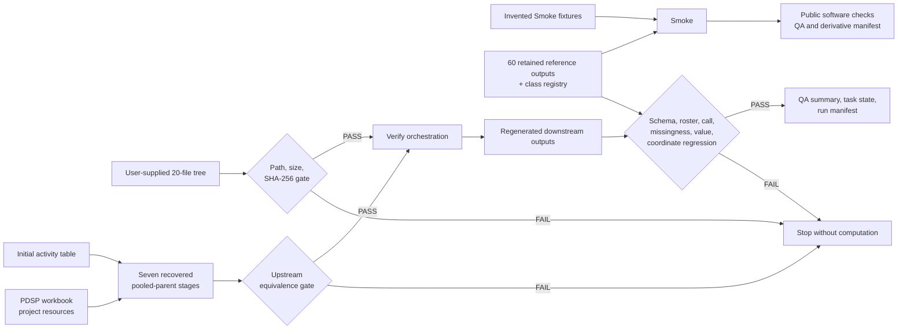
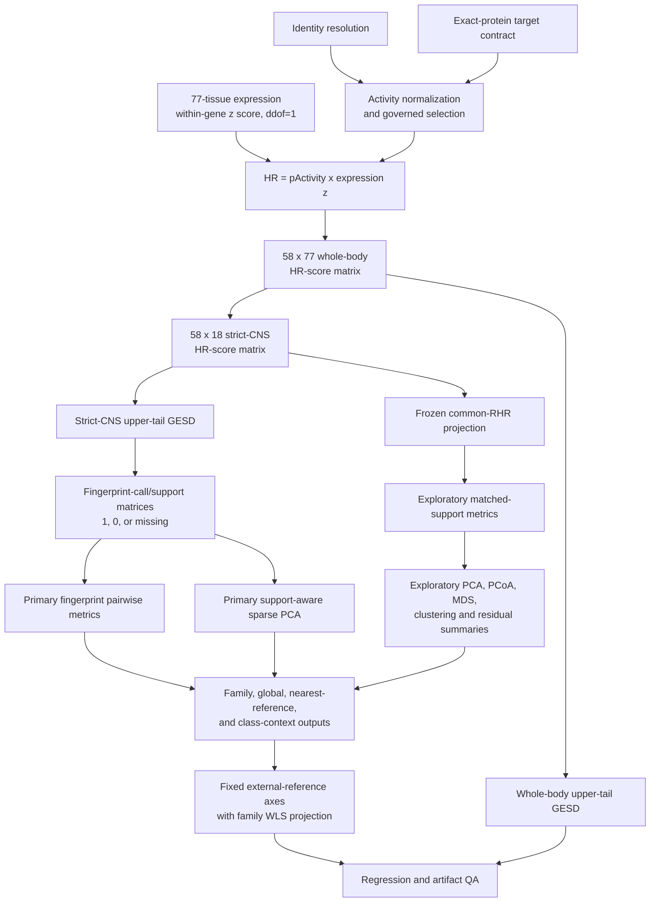

# Code architecture

## Design goals

The package keeps scientific computation, orchestration, input provenance, and
regression validation explicit. Its central constraints are:

- preserve compound, target, and tissue identity;
- retain censored relation operators and missing values;
- never convert unsupported coordinates into tested non-calls;
- keep primary sparse-fingerprint analyses separate from exploratory continuous
  analyses;
- never refit accepted fixed-reference models during reproduction;
- route excluded scientific inputs only through an explicit, hash-validated
  external root;
- write derivatives outside frozen inputs and retained reference outputs;
- fail closed when a governed contract differs.

## Public/external data boundary

The public repository contains code, configuration, invented Smoke fixtures,
60 accepted reference-output files, and one class-membership registry. The 20
near-source inputs needed by Verify and Full remain outside Git. The public
process receives them through `--external-input-root` and validates them against
[`EXTERNAL_INPUT_MANIFEST.tsv`](../EXTERNAL_INPUT_MANIFEST.tsv).



Plain-text fallback:

```text
synthetic fixtures + retained-output hashes -> Smoke -> public software evidence

external 20-file input tree -> size/hash gate -> Verify -> regenerated outputs
retained reference outputs -------------------------------> regression gate

initial activity + PDSP + project resources -> 7 recovered stages
                                                -> upstream equivalence -> Verify

any failed gate -> nonzero exit; no scientific-input substitution
```

## End-to-end scientific flow



The frozen common-RHR scale is a versioned cross-profile boundary. Verify does
not fit it, and Full retains it only after regenerated pooled raw-HR values pass
the upstream equivalence gate. Figure 4 is rendered from frozen coordinates;
its axes and points are not refit, moved, or jittered.

## Execution paths

### Smoke

`launchers/Smoke.ps1` delegates to `launchers/Run.ps1`, which invokes
`cardozo_ketamine_hr.portable` in `Smoke` mode. The path:

1. validates all 61 retained scientific/reference file hashes;
2. reads three invented CSV fixtures;
3. checks HR calculation, missingness, sparse metrics, and deterministic
   multivariate behavior;
4. renders a synthetic figure;
5. writes QA, state, and a derivative manifest.

Smoke never calls the external input resolver and never evaluates ketamine
measurements.

### Verify

`launchers/Verify.ps1` requires `-ExternalInputRoot` and invokes the same
portable entry point. The path:

1. checks all 20 external inputs against the external manifest;
2. validates and reconstructs pooled full77/strict18 HR contracts;
3. assembles the 30-profile base plus five additional metabolite profiles;
4. rebuilds raw-HR, common-RHR, support, and two fingerprint-call matrices for
   35 profiles;
5. computes 45 family and 595 global unordered pair rows;
6. generates sparse primary and continuous exploratory models;
7. generates class, nearest-reference, residual, whole-body, and fixed Figure 4
   derivatives;
8. compares every represented output with accepted references;
9. writes the 87-check ledger and terminal state.

### Full

Full adds the recovered scripts in `src/cardozo_ketamine_hr/upstream/`. It
generates pooled-parent activity, expression-recovery, HR, and strict-CNS
outputs in an external derivative tree, applies eight upstream checks, and
passes only validated regenerated HR artifacts into downstream Verify. Stage
reuse is provenance-gated, not timestamp-routed. See
[`FULL_MODE.md`](FULL_MODE.md).

## Package map

| Area | Modules | Responsibility |
|---|---|---|
| Entry and orchestration | `__main__`, `portable`, `pipeline` | CLI dispatch, supported lanes, stage ordering, persisted state, and complete comparative workflow |
| External discovery | `authority_discovery`, `resource_manager`, `gpu_backend` | Explicit external roots and bounded execution resources; CPU float64 is the release lane |
| Identity and preprocessing | `identity`, `targets`, `tissue_normalization`, `activity`, `expression` | Conservative identity mapping, exact-protein contract, tissue labels, activity/censoring, and within-gene expression standardization |
| Core representation | `hr`, `fingerprint` | HR construction and deterministic one-sided upper-tail GESD calls |
| Profile assembly | `query_freeze`, `family_analysis`, `family_completion` | Pooled query, family profile, and additional-metabolite assembly under fixed contracts |
| Pairwise analysis | `pairwise_fingerprint`, `pairwise_continuous`, `nearest_reference`, `residual_analysis` | Primary sparse call metrics, exploratory matched-support metrics, query orientation, and residual recurrence |
| Multivariate analysis | `multivariate`, `class_analysis`, `coverage_diagnostics` | Sparse/continuous models, fixed projection, ordination, clustering, class contexts, and support diagnostics |
| Persistence and presentation | `tables`, `figures`, `figure_repair`, `packaging` | Deterministic tables, figures, manifests, PDF/ZIP packaging, and visual-only repair |
| Quality assurance | `qa`, `independent_validation`, `final_audit` | In-run contracts, disk-based acceptance, and completed-run audits |
| Shared helpers | `utilities` | Hashing, deterministic I/O, coercion, relative paths, and timing |
| Recovered upstream | `upstream/*.py` | Seven pooled-parent reconstruction stages plus governed whole-body/Figure 4 utilities |

The `workflow/Snakefile` is a retained wrapper, not the recommended release
entry point. Use `launchers/` because those scripts enforce the public external
input boundary and report failures consistently.

## Important in-memory schemas

### Activity

The selected activity contract centers on:

| Field | Meaning |
|---|---|
| `canonical_target_id` | Exact target identity used for expression mapping |
| `final_selected_pActivity_v4` | Selected `-log10(activity in M)` numerical value or retained boundary |
| `final_activity_relation_operator_v4` | Original relation such as `=`, `>`, or `<` |
| `final_activity_is_bounded_v4` | Whether the numerical value is a censored boundary |

Relation direction must be interpreted with the concentration boundary. A
right-censored `Ki > 10,000 nM` is not an exact affinity measurement.

### Expression and feature contract

Expression rows identify target, tissue, tissue label, and within-target
`expression_z`. The feature contract adds a stable `feature_id`, canonical
target and tissue identifiers, target grain, and expression-profile identity.
Only compatible exact-protein mappings enter HR construction.

### HR-score and profile matrices

Long-form HR rows contain canonical target/tissue keys and a numerical HR
value. Those values form the numerical target × anatomy HR-score representation
for a compound. Cross-compound profile matrices are `compound × feature_id`
tables for:

- `raw_hr`, where unsupported coordinates are missing;
- `common_rhr`, the frozen projected continuous representation;
- `support`, indicating tested/available coordinates;
- `call_binary_alpha001` and `call_binary_alpha0001`, where `1` is called, `0`
  is a tested non-call, and unsupported coordinates remain missing.

The `call_binary_*` tables are fingerprint-call matrices representing sparse
fingerprint membership. They are not HR-score matrices.

### Fingerprint calls

Call rows include compound, feature, target, tissue, raw/common HR, alpha,
GESD step, test statistic, critical value, and deterministic rank. Primary
analysis uses α = 0.001 and sensitivity uses α = 0.0001.

### Pairwise and model outputs

Pairwise rows use unordered `drug_a`/`drug_b` keys and report matched feature
counts, continuous distances/similarities, support overlap, call counts,
intersection/union sizes, Jaccard/overlap measures, target/tissue overlap, and
signed sparse cosine at both alpha levels. Model tables include explicit
`analysis_id`, representation, method, coordinates/loadings or distances, and
status/limitation records. Non-estimable models remain explicit rather than
being filled with fabricated coordinates.

## Input and output lineage

The primary file-to-stage mapping is configured in `configs/`. Runtime roles are
resolved to explicit external paths; the YAML path strings document the
historical relative contract and are not permission to fall back to missing
public files. `portable.py` is the supported public routing layer.

All run artifacts are derivatives. Inputs and retained references are read
only. Unless the caller specifies `-OutputDir`, launchers write under ignored
`results/runs/<mode>_<timestamp>/`. `task_state.json` records success or the
terminal exception, `QA_SUMMARY.csv` records check-by-check evidence, and
`MANIFEST.tsv` records the output byte inventory.

## Regression-reference behavior

Regression comparison is structural before numerical:

1. require the expected artifact and schema;
2. compare key fields, roster, shape, and ordering contracts;
3. compare missingness and categorical/status values;
4. compare exact call membership and fixed coordinates;
5. compare numerical fields within the recorded tolerance;
6. fail the lane if any required check fails.

The 60 retained references are immutable accepted outputs. Developers must not
update them merely to make a changed implementation pass. A proposed
scientific change requires explicit review, independent equivalence or
justification, and a versioned replacement contract.

## Primary versus exploratory interpretation

Sparse GESD call membership and derived fingerprint comparisons are the
principal analyses. Common-RHR distances, correlations, ordinations, and
clusters are exploratory. Neither lane establishes causality. The separation is
encoded in module boundaries, output names, model-status tables, and the
scientific documentation rather than being only a narrative label.

For change procedures and validation commands, see
[`DEVELOPER_GUIDE.md`](DEVELOPER_GUIDE.md).
